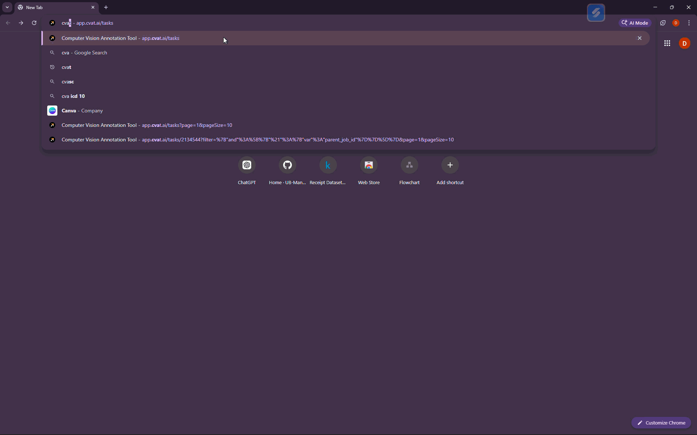
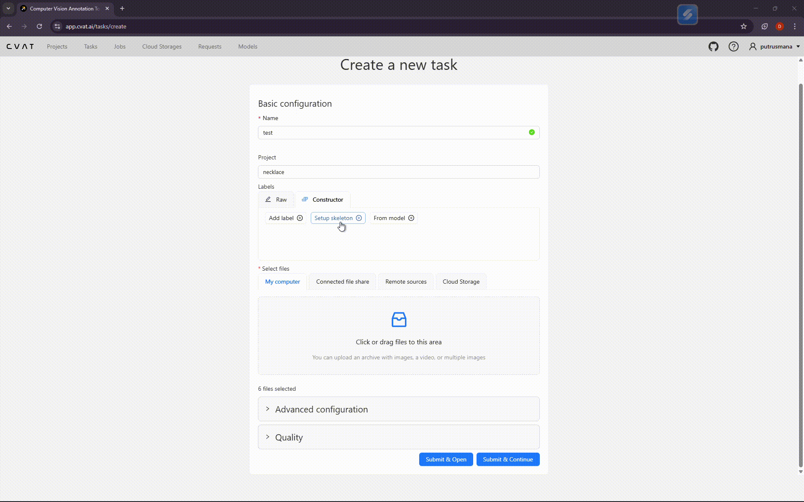
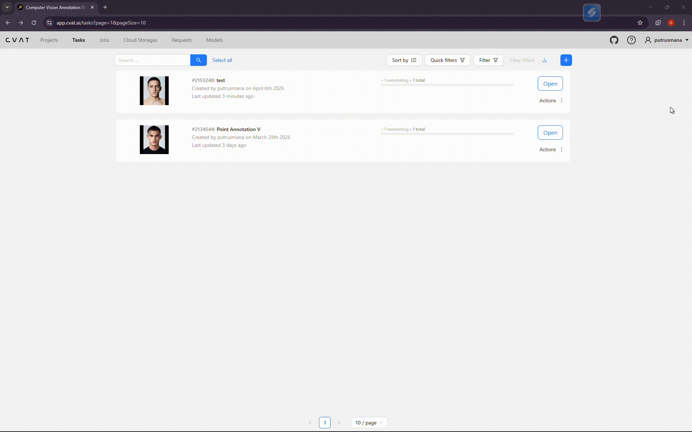
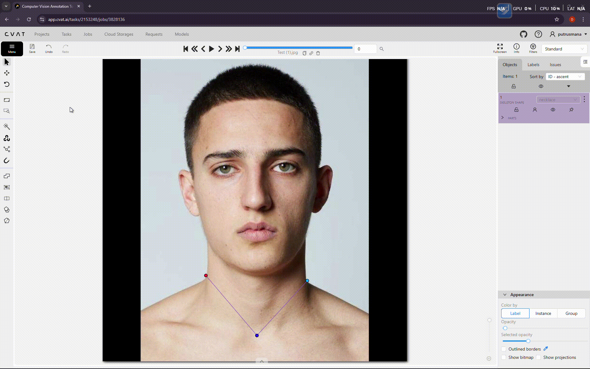

## 📊 Dataset Preparation Guide

### 1. Download Dataset
The dataset used in this project can be downloaded from Kaggle:
https://www.kaggle.com/datasets/osmankagankurnaz/human-profile-photos-dataset

---

### 2. Open CVAT
For image annotation, this project uses **CVAT (Computer Vision Annotation Tool)**.
https://app.cvat.ai/

---

### 3. Login to CVAT
To start using CVAT, log in to your account.

- If you don’t have an account yet, you can sign up using:
  - Google  
  - GitHub  

---

### 4. Upload Images
To upload images:

1. Go to the **Tasks** tab  
2. Click the **“+”** button → **Create New Task**  
3. Fill in:
   - Project (optional)  
   - Task name  
4. Upload images by:
   - Clicking **“Click or drag files”**, or  
   - Dragging and dropping your images  
5. Select all desired images and click **Open**

Uploaded images will appear in the preview section below.

---

### 5. Assign Skeleton
To create a skeleton for keypoint annotation:
1. In the **Create New Task** page, go to the **Constructor** tab  
2. Click **Setup Skeleton**  
3. Upload a sample image  
4. Define keypoints by clicking on the image  
5. To connect keypoints:
   - Press `\` (backslash)  
   - Click the points you want to connect  
6. Enter a name for the skeleton  
7. Click:
   - **Submit & Open**, or  
   - **Submit & Continue**

You can view your created task in the **Tasks** tab.

---

### 6. Annotating Images
To annotate images:
1. Open your task  
2. Go to the **Jobs** section and select a job  
3. In the annotation interface:
   - Use the left toolbar (neuron-like icon)  
   - Select **Shape** (or skeleton tool if configured)  
4. Place and adjust keypoints according to the image  
5. Don’t forget to click **Save**

---

### 7. Export Dataset
After completing all annotations:

1. Open the menu  
2. Click **Export job as a dataset**  
3. Choose the desired format  
4. Wait for the export process to complete  
5. Click **Download** (via the three-dot menu)

The dataset will be downloaded as a `.zip` file.

